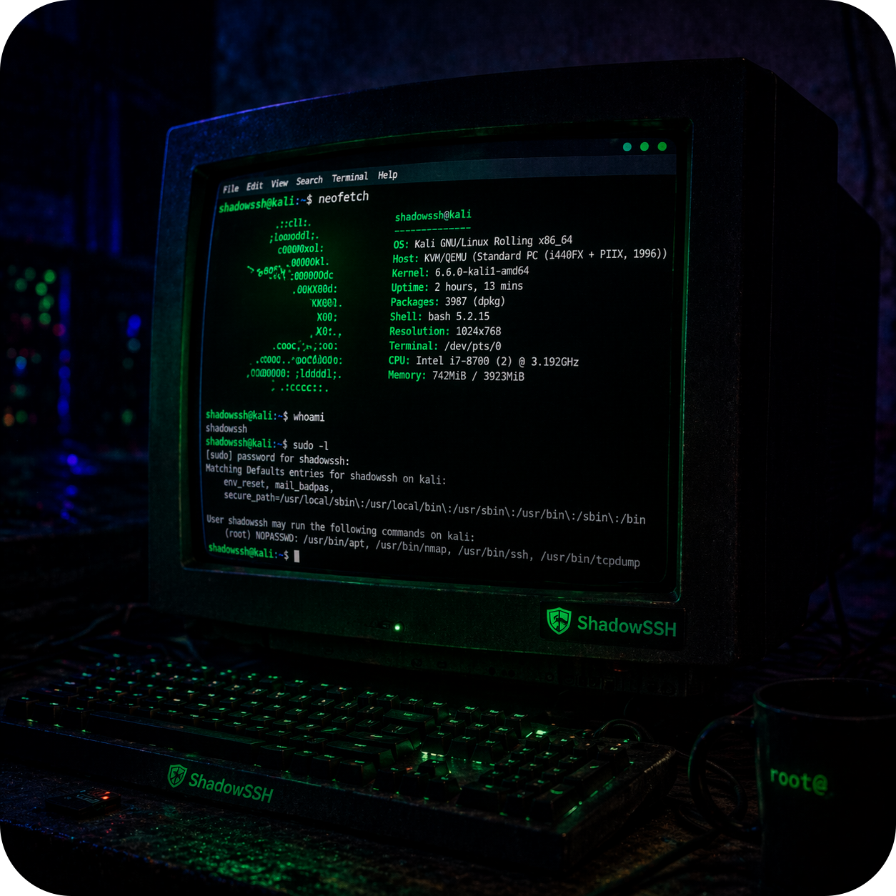
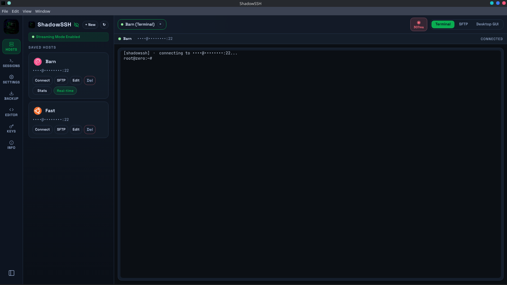
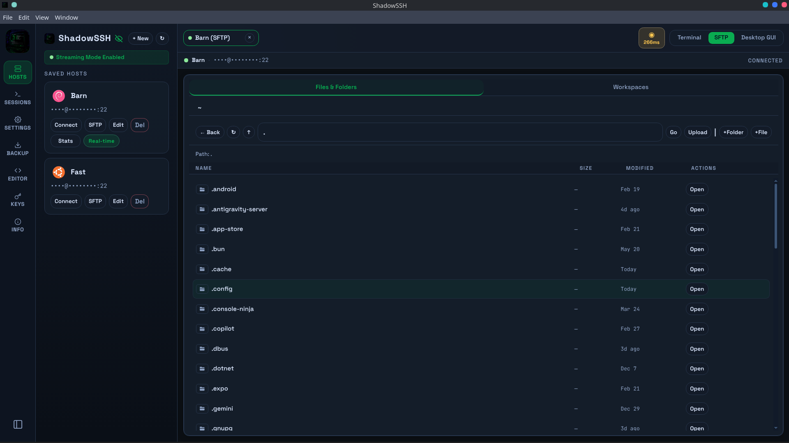
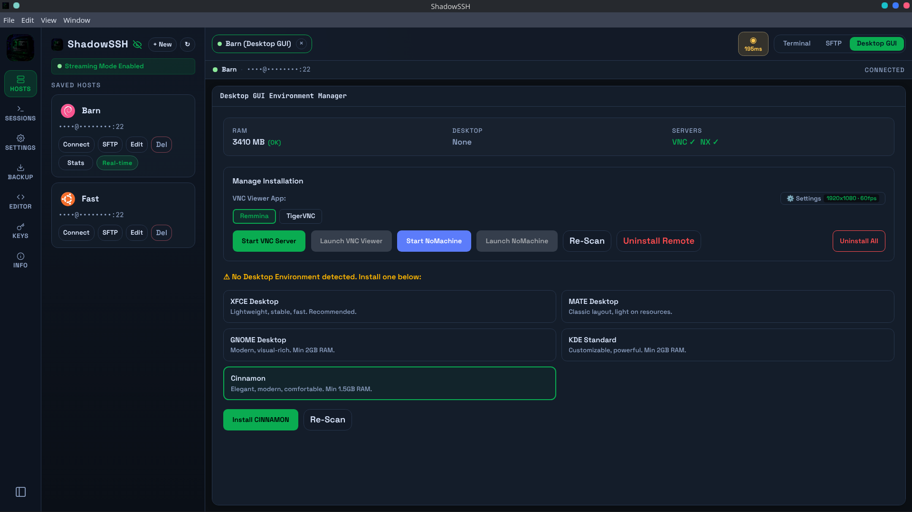

<p align="center">
  
</p>

<h1 align="center">ShadowSSH</h1>

<p align="center">
  A fast, modern desktop SSH client with multi-tab sessions, SFTP, desktop GUI management, key management, and more.
</p>

<p align="center">
  
  
  
  
  
</p>

---

## App Preview

| SSH Terminal | SFTP File Browser | VPS Desktop GUI |
|:---:|:---:|:---:|
|  |  |  |

---

## Features

### 🖥️ Terminal
- 🗂️ **Multi-tab SSH sessions** — open unlimited connections simultaneously, each with its own tab and status indicator
- ⚡ **Full xterm.js terminal** — true color support, scrollback buffer, keyboard shortcuts
- 🎨 **8 terminal themes** — Oceanic, Matrix, Amber, Nord, Dracula, Solarized, Green, White
- 📡 **Real-time latency indicator** — live ping display in the tab header per active session

### 📁 File Management
- 📂 **SFTP browser** — navigate, upload, download, rename, delete remote files without leaving the app
- 📌 **Configurable start path** — set a default SFTP directory per host
- 🗂️ **Workspaces** — sync local folders to remote paths for fast file editing

### 🖼️ Desktop GUI Manager (powered by [SMD](https://github.com/ismdevz/SMD))
- 🚀 **Install desktop environments** directly on your remote VPS/server from the app — no manual SSH commands needed
- 🗑️ **Uninstall desktop environments** cleanly, with full package cleanup
- 📊 **System info panel** — shows RAM, installed DEs, package manager, and distro info
- **5 supported desktop environments:**

| Desktop | Package Manager Support |
|---------|------------------------|
| XFCE | apt · dnf · pacman · apk · zypper |
| MATE | apt · dnf · pacman · apk · zypper |
| GNOME | apt · dnf · pacman · apk · zypper |
| KDE Plasma | apt · dnf · pacman · apk · zypper |
| Cinnamon | apt · dnf · pacman · apk · zypper |

### 🔐 Security & Privacy
- 🏠 **100% local** — no cloud, no telemetry, no account required. Everything stays on your machine
- 🔒 **Fully encrypted storage** — all saved hosts, passwords, and passphrases are encrypted at rest using AES-256 via electron-store
- 🗝️ **Private key support** — connect using Ed25519 or RSA keys; keys never leave your machine and are never transmitted or logged
- 🛡️ **SSH key generator** — generate strong Ed25519 / RSA keys directly in the app, no terminal required
- 🌐 **Jump host / proxy** — securely connect through a bastion server with full credential support

### 🖥️ Host Management
- 📋 **Host manager** — save hosts with labels, OS icons, auth settings, and jump server config
- 🐧 **20+ distro icons** — automatic OS detection with matching icons (Ubuntu, Arch, Kali, Debian, and more)
- 📊 **Real-time stats** — CPU, RAM, and uptime monitoring per host

### 🛠️ Productivity
- 📝 **Config file editor** — edit remote config files in-app
- 💾 **Backup & restore** — export/import your saved hosts with optional password encryption
- 🔄 **Auto updates** — checks for new releases automatically via GitHub and notifies in-app

### 🎨 Appearance
- 🌗 **3 UI themes** — Dark, Light, and Onyx
- 🔤 **Customizable font size & font family** — tweak the terminal to your preference

---

## Download

Grab the latest release from the [Releases](https://github.com/ismdevz/ShadowSSH/releases) page.

| Platform | Package | Status |
|----------|---------|--------|
| Linux    | `.deb` · `.rpm` · `.AppImage` | ✅ Available |

---

## Install

### Debian / Ubuntu / Kali / Mint (.deb)
```bash
sudo dpkg -i shadowssh_1.0.2_amd64.deb
```

### Fedora / RHEL / CentOS (.rpm)
```bash
sudo rpm -i shadowssh-1.0.2.x86_64.rpm
```

### AppImage
```bash
chmod +x ShadowSSH-1.0.2.AppImage
./ShadowSSH-1.0.2.AppImage
```

---

## Build from Source

**Requirements:** Node.js 20+, npm, [Bun](https://bun.sh)

```bash
git clone https://github.com/ismdevz/ShadowSSH.git
cd ShadowSSH
npm install
```

| Command | Description |
|---------|-------------|
| `npm run dev` | Start in development mode (hot-reload) |
| `npm run dist` | Build Linux packages (`.deb` + `.rpm` + `.AppImage`) |

Output goes to `dist-packages/`.

---

## Tech Stack

| Layer | Technology |
|-------|-----------|
| Runtime | Electron 42 |
| UI | React 19 + TypeScript |
| Terminal | xterm.js 6 |
| Styling | Tailwind CSS 4 |
| SSH | ssh2 |
| Storage | electron-store |
| Updates | electron-updater |
| Bundler | Vite 8 |
| GUI Manager | [SMD](https://github.com/ismdevz/SMD) |

### About SMD

[SMD (Server Manager Daemon)](https://github.com/ismdevz/SMD) is an open-source CLI tool built by ismdevz that powers the Desktop GUI management features inside ShadowSSH. It is a standalone binary compiled with Bun that runs on the remote server and handles:

- Detecting installed desktop environments and system info
- Installing / uninstalling desktop environments (XFCE, MATE, GNOME, KDE, Cinnamon)
- Managing remote desktop tools (NoMachine, TigerVNC, noVNC, XRDP)
- Querying system RAM, distro, and package manager info

ShadowSSH bundles a pre-compiled `smd-linux` binary inside the app resources and uploads it to the server on demand, so no manual setup is required on the remote machine.

---

## License

MIT © [ismdevz](https://github.com/ismdevz)
